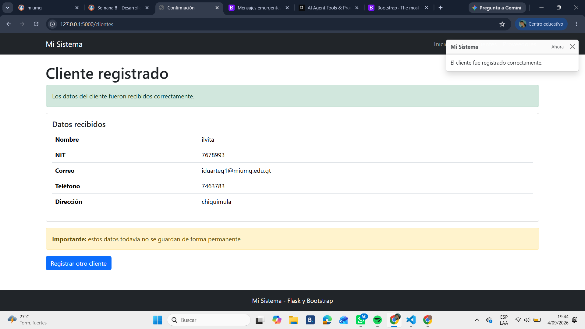

# 036-bootstrap-formularios
Formularios de Negocio con Bootstrap y Flask

## Toast de confirmación

Agrgue un componente Toast en `templates/clientes_confirmacion.html`.
El toast muestra temporalmente el mensaje "El cliente fue registrado correctamente"
cuando se carga la página de confirmación después de enviar el formulario de clientes.

El mensaje puede cerrarse con el botón `x` y desaparece automáticamente después de
cinco segundos. 

